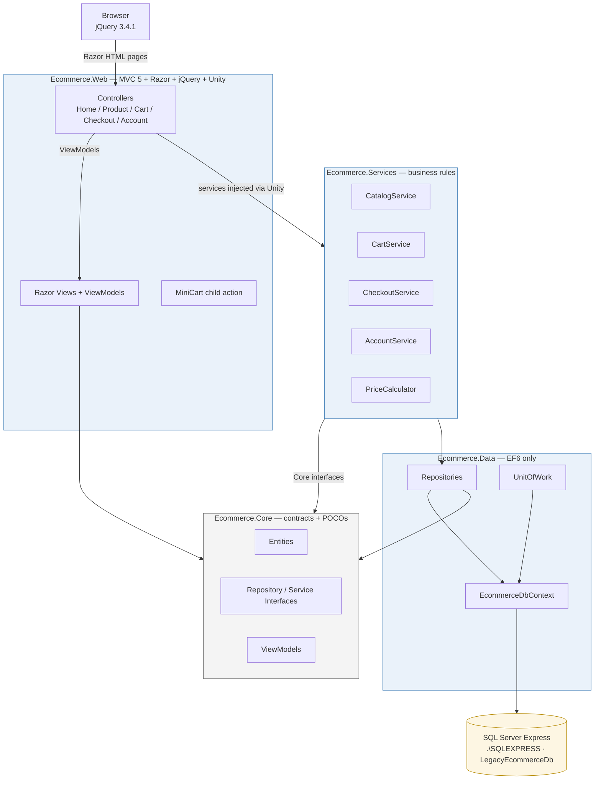

# 🛒 Legacy eCommerce Platform

**A classic, monolithic eCommerce storefront on .NET Framework 4.7 — ASP.NET MVC 5, Razor views, jQuery, EF 6 and SQL Server Express.**


-2c3e50)


---

## 📌 Overview

Server-side rendered MVC 5 application with Razor `.cshtml` templates generating full HTML pages. jQuery (3.4.1) enhances the UX via AJAX — cart updates, product filtering and lazy category trees — without any SPA framework. Data access is Entity Framework 6 (Repository + UnitOfWork) against **SQL Server Express**, hosted on **IIS Express** for local development and full **IIS** (CLR v4.0 integrated app pool) for production. Dependency wiring uses the **Unity DI container**.

|                         |                     |
| ----------------------- | ------------------- |
| **Pattern**             | ASP.NET MVC 5 (Model-View-Controller), Service Layer + Repository |
| **View engine**         | Razor (`.cshtml`), partials + child actions |
| **Clientside**          | jQuery 3.4.1, jQuery UI 1.12.1, jQuery Validate, Unobtrusive AJAX, DataTables, Fancybox 3 |
| **Data access**         | Entity Framework 6.4.4 (`System.Data.SqlClient`) |
| **Container**           | Unity 4 (legacy) — per-request lifetime |
| **Auth**                | OWIN cookie authentication (no third-party identity provider) |
| **Runtime**             | .NET Framework 4.7 / 4.8, ASP.NET MVC 5.2.7 |

---

## 🏛 Application Architecture



**Rules the architecture enforces:**

- **Controllers never talk to EF.** They bind input, call a service, and return a `View` / `PartialView` / `JsonResult`.
- **Views bind to ViewModels, never EF entities.** `_ProductCard.cshtml` takes a `ProductCardViewModel`, keeping designer/EDMX types out of the UI boundary (important for a future .NET 8 + Vue rewrite).
- **Repositories are the only types that touch `DbContext`.** All reads/writes flow `Controller → Service → Repository → EcommerceDbContext`.
- Dependency direction is strictly inward: `Ecommerce.Web → Ecommerce.Services → Ecommerce.Data → Ecommerce.Core`. `Ecommerce.Core` has zero references to EF, MVC, jQuery or `HttpContext`.

---

## 📁 Solution Structure

```
LegacyEcommerce.sln
├── Ecommerce.Core              // no EF, no MVC — contracts + POCOs + ViewModels
│   ├── Entities/               Product, Category, ProductImage, ProductVariant,
│   │                           CartItem, Order, OrderLine, Customer, Address
│   ├── ViewModels/             ProductList, ProductDetail, ProductCard, Cart,
│   │                           MiniCart, Checkout (Address/Shipping/Payment),
│   │                           Login, Register, OrderHistory, OrderSummary
│   ├── Interfaces/
│   │   ├── Repositories/       IProduct, ICategory, ICart, IOrder, ICustomer
│   │   └── Services/           ICatalog, ICart, ICheckout, IAccount
│   └── Common/                 PagedResult, ServiceResult, ServiceResult<T>
│
├── Ecommerce.Data              // EF 6 only — DbContext + repository implementations
│   ├── EcommerceDbContext.cs
│   ├── Repositories/           Product, Category, Cart, Order, Customer
│   └── Infrastructure/         UnitOfWork.cs
│
├── Ecommerce.Services          // business rules — no HttpContext, no Razor
│   ├── CatalogService.cs  CartService.cs  CheckoutService.cs  AccountService.cs
│   ├── Pricing/PriceCalculator.cs         // shipping tiers, coupon %, tax 8%
│   └── Security/PasswordHasher.cs         // PBKDF2 (10k iters, SHA-256)
│
└── Ecommerce.Web               // MVC 5 + Razor + jQuery + Unity
    ├── App_Start/              BundleConfig, FilterConfig, RouteConfig,
    │                           UnityConfig, Startup.Auth.cs
    ├── Controllers/            Home, Product, Cart, Checkout, Account
    ├── Filters/                AjaxValidateAntiForgeryTokenAttribute.cs
    ├── Helpers/                CartSessionHelper.cs
    ├── Views/                  Shared (layout, header, footer, sidebar,
    │                           minicart, product card) · module views
    ├── Content/  Scripts/      Bootstrap 3, jQuery UI, jQuery Validate,
    │                           DataTables, Fancybox — vendored, offline-safe
    ├── Global.asax.cs  Startup.cs
    └── web.config
```

---

## 📦 Layer Responsibilities

| Layer | Owns | Never |
| ----- | ---- | ----- |
| **Ecommerce.Core** | POCOs matching SQL tables, ViewModels, all repository/service interfaces, `PagedResult`/`ServiceResult` | EF, MVC, jQuery, `HttpContext` |
| **Ecommerce.Data** | `EcommerceDbContext`, repository implementations (LINQ, `.Include()`, `SaveChanges`), `UnitOfWork` | Controllers, business rules, session |
| **Ecommerce.Services** | Use-cases: add to cart, apply coupon, place order, register/login, order history; maps entities → ViewModels; PBKDF2 hashing | SQL, `HttpContext`, Razor |
| **Ecommerce.Web** | Thin controllers, Razor views (bind ViewModels), session cart key, OWIN identity, Unity wiring per request | Direct SQL, EF queries |

---

## 🧩 Core Modules

| Module | Flow | ViewModels |
| ------ | ---- | ---------- |
| **Catalog** | `ProductController` → `ICatalogService` → `ProductRepository` + `CategoryRepository` | `ProductListViewModel`, `ProductDetailViewModel`, `ProductCardViewModel` |
| **Cart** | `CartController` (MiniCart child action + AJAX add/update/remove/coupon) → `ICartService` reads/writes session | `CartViewModel`, `MiniCartViewModel` |
| **Checkout** | Wizard: Address → Shipping → Payment → Confirmation; `ICheckoutService.PlaceOrder()` creates `Order` + `OrderLine`; anti-forgery on every POST | `CheckoutAddressViewModel`, `CheckoutShippingViewModel`, `CheckoutPaymentViewModel`, `OrderSummaryViewModel` |
| **Account** | OWIN cookie auth; `IAccountService` (register/login/logout) + `IOrderRepository` for history | `LoginViewModel`, `RegisterViewModel`, `OrderHistoryViewModel` |

---

## 📄 Razor Template Hierarchy

```
~/Views/Shared/_Layout.cshtml
├── _Header.cshtml       (logo, search, mini cart)   ← @Html.Partial("_Header")
├── _RenderBody()        (main content area)
├── _Sidebar.cshtml      (category menu, lazy-loaded tree)  ← @Html.Action("Sidebar","Product")
└── _Footer.cshtml       (@Html.Partial("_Footer"))

Layout renders:  @Styles.Render("~/Content/css")
                 @Scripts.Render("~/bundles/jquery") / jqueryval / jqueryajax / bootstrap
                 @RenderSection("Scripts", required: false)
```

**Razor + AJAX integration**

| Pattern | Implementation |
| --- | --- |
| Product filtering | jQuery intercepts the filter form, AJAX GET to `/Product/Filter`, partial `_ProductList` replaces `#product-grid` |
| Mini cart | Layout child action `@Html.Action("MiniCart","Cart")`; after an add, `$('#mini-cart-container').load('/Cart/MiniCart')` |
| Add to cart | `$.post('/Cart/Add', { productId, quantity })` — no page refresh; badge + totals update via the partial |
| Image gallery | `[data-fancybox="gallery"]` + Fancybox 3 (vendored, offline) |
| Order history | jQuery **DataTables** (sortable, column `order: [[1,'desc']]`) |
| Page JS | `@section Scripts { }` per view, rendered after the bundles |

---

## 🗄 Data Access — EF 6 + SQL Server Express

```
Controller → Service → Repository → EcommerceDbContext → .\SQLEXPRESS · LegacyEcommerceDb
```

- **EF 6.4.4** mappings are defined in code (`EcommerceDbContext` + annotations); `DatabaseSetup.sql` is the single source of truth for the schema and seed data.
- **Connection string** `EcommerceDb` (provider `System.Data.SqlClient`, app login `legacy_app_user`, `MultipleActiveResultSets=True`).
- Repository pattern avoids N+1 via `.Include()` on listing/detail queries.
- One `SaveChanges()` per HTTP request through `UnitOfWork`.
- **SQL Server Express** instance `.\SQLEXPRESS`, database **`LegacyEcommerceDb`** (10 GB Express cap, ~1.4 GB buffer pool, no SQL Agent — maintenance via scripts).

```xml
<connectionStrings>
  <add name="EcommerceDb"
       connectionString="Server=.\SQLEXPRESS;Database=LegacyEcommerceDb;
                         User Id=legacy_app_user;Password=****;MultipleActiveResultSets=True;"
       providerName="System.Data.SqlClient" />
</connectionStrings>
```

---

## 🔐 Security

| Concern | Implementation |
| --- | --- |
| **CSRF** | `@Html.AntiForgeryToken()` in every Razor form + `ValidateAntiForgeryToken` on every POST action |
| **AJAX CSRF** | Global jQuery prefilter appends the token to every POST body; the `AjaxValidateAntiForgeryToken` filter also accepts header tokens for browser compatibility |
| **Authentication** | OWIN cookie auth (`ApplicationCookie`), `[Authorize]` on protected controllers/pages, `authentication mode="None"` |
| **Passwords** | PBKDF2 — 10,000 iterations, 16-byte salt, 32-byte hash (`Ecommerce.Services\Security\PasswordHasher.cs`, no plaintext stored) |
| **Claims** | `AntiForgeryConfig.UniqueClaimTypeIdentifier = ClaimTypes.NameIdentifier` binds tokens to the logged-in user |
| **Session cart** | Server-side `HttpSessionState` (InProc, 25 min), never trusted from client input |

---

## ⚙ Configuration Highlights (`web.config`)

```xml
<system.web>
  <compilation debug="false" targetFramework="4.7" />
  <httpRuntime targetFramework="4.7" maxRequestLength="30720" />
  <sessionState mode="InProc" timeout="25" />
  <authentication mode="None" /> <!-- OWIN handles auth -->
</system.web>
```

---

## 🧪 Testing & Verification

### Automated smoke test

Runnable anywhere (PowerShell) against a running instance:

```powershell
powershell -ExecutionPolicy Bypass -File scripts\smoke-test.ps1
# optional: -BaseUrl http://192.168.x.x:50861
```

Verifies: all pages return **200** (home, products, detail, cart, login, register, mini-cart), the real anti-forgery form-field flow for **add-to-cart**, **coupon apply**, and that POSTs **without** a token are rejected.

### End-to-end flows verified (2026-08-31)

| Flow | Result |
| --- | --- |
| Build (`MSBuild Ecommerce.Web.csproj`) | exit 0 |
| Home + product listing/detail/search | 200 |
| Cart add/update/remove + coupon | 200, correct pricing |
| Coupon SAVE10 (-10%), free shipping ≥ $75 else $9.95, tax 8% | verified with real order math |
| Checkout wizard Address → Shipping → Payment → Confirmation | complete order created (`ORD-…`, status Pending) |
| Order history, register, login, logout | verified (redirects + `[Authorize]` return URL) |
| AJAX endpoints (`Subcategories`, `Filter`, `MiniCart`) | JSON / partial HTML |
| DB reads/writes via `legacy_app_user` | verified (Orders + OrderLines rows) |

### Manual browser checklist

1. Sign in with the demo account → cart → add items → badge + totals update without refresh.
2. Apply `SAVE10` → discount appears on subtotal.
3. Proceed to checkout: Address → Shipping → Payment (`4111 1111 1111 1111`) → Confirmation.
4. Open `/Account/Orders` → order listed in the DataTable.
5. Product detail → click gallery thumbnails (Fancybox) opens lightbox.

> **Known limitations (legacy stack):** Razor views compile at runtime (errors surface only when a page is hit); jQuery version conflicts are the main maintenance hazard; Express has a 10 GB DB cap — archive old orders and rebuild indexes weekly (no SQL Agent on Express).

---

## 🚀 Running Locally

```powershell
# 1. Create the database (one-time)
sqlcmd -S .\SQLEXPRESS -E -i DatabaseSetup.sql

# 2. Build
MSBuild.exe LegacyEcommerce.sln /t:Restore /t:Build -m:1

# 3. Serve with IIS Express
"C:\Program Files\IIS Express\iisexpress.exe" /path:"<repo>\Ecommerce.Web" /port:50861 /clr:v4.0

# 4. Open
start http://localhost:50861/
```

> On this machine a `start-site.bat` double-click does steps 3+4 (binds `0.0.0.0`, so the site is also reachable on the LAN — e.g. `http://192.168.31.183:50861/`). For demoing to someone on a different network, an ngrok tunnel supplies the public URL: `ngrok http 50861`.

### Demo account

| Field | Value |
| ----- | ----- |
| Email | `demo@legacy.store` |
| Password | `Password123!` |

Order history appears after signing in (`/Account/Orders`).

---

## 📦 NuGet & Frontend Dependencies

`Microsoft.AspNet.Mvc 5.2.7` · `Microsoft.AspNet.Razor 3.2.7` · `EntityFramework 6.4.4` · `Unity 4.0.1` · `Microsoft.jQuery.Unobtrusive.Ajax` · `jQuery.Validation` · `Newtonsoft.Json 12.0.3` · Bootstrap 3 · jQuery 3.4.1 · jQuery UI 1.12.1 · DataTables 1.10.21 · Fancybox 3.5.7.

All frontend assets are **vendored** under `Scripts/` and `Content/` (no CDN at runtime → the site runs fully offline).

---

## ⚠ Notes / Deviations

- **No `Microsoft.AspNet.Identity`** — lightweight custom `ClaimsIdentity` on OWIN (same wire surface as the spec's "ApplicationUser stays in Web"; passwords PBKDF2-hashed).
- **EF mappings are code-first** instead of an EDMX designer file (schema identical; `DatabaseSetup.sql` is the source of truth) — nothing designer-generated to drag into a future rewrite.
- Package versions pinned; NuGet may warn `NU1903` for the old OWIN/Newtonsoft versions (no safe upgrade path on .NET 4.7).

---

🛒 *Legacy eCommerce · .NET 4.7 MVC · Razor Views · jQuery · SQL Server Express · IIS Express (dev) / IIS (prod)*