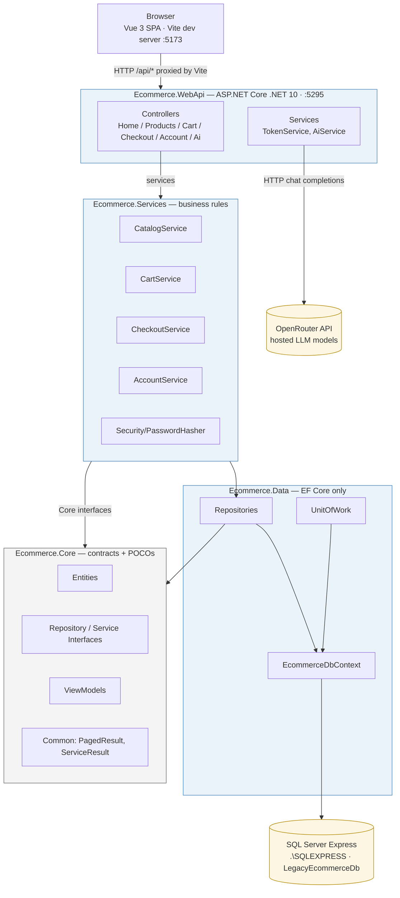

# 🛒 Legacy eCommerce Platform

**A modern eCommerce storefront — ASP.NET Core (.NET 10) REST API backend + Vue 3 SPA frontend, with an AI shopping assistant powered by OpenRouter.**


---

## 🔗 Live Demo

| Access | URL |
| --- | --- |
| **Public (any network)** | **[https://quarry-bankroll-juicy.ngrok-free.dev](https://quarry-bankroll-juicy.ngrok-free.dev)** |
| Local frontend (Vite dev server) | http://localhost:5173 |
| Local backend (WebApi) | http://localhost:5295 |
| Swagger / OpenAPI | http://localhost:5295/openapi/v1.json |

> **Demo login:** `demo@legacy.store` / `Password123!` — coupon code `SAVE10` gives −10%, free shipping on orders over **$75**.
> The public URL comes from an `ngrok http 5173` tunnel; it **changes every time the tunnel restarts**, so regenerate it before each demo (see [Running Locally](#-running-locally)).

---

## 📌 Overview

A full-stack rewrite of the original .NET Framework 4.7 / MVC 5 / jQuery storefront. The legacy MVC presentation layer was replaced with a **Vue 3 single-page application**, and the backend was migrated to a clean **ASP.NET Core .NET 10 Web API** serving JSON. The existing layered architecture (Core contracts → Services → Repository → EF DbContext) was preserved, along with the same SQL Server Express database schema.

|                         |                     |
| ----------------------- | ------------------- |
| **Frontend**            | Vue 3 (Composition API), Vue Router 4, Pinia, Axios, Vite 8 |
| **Backend**             | ASP.NET Core Web API on .NET 10, minimal APIs not used — MVC controllers |
| **Data access**         | Entity Framework Core 10 + SQL Server Express |
| **Auth**                | JWT bearer tokens (stateless), `[Authorize]` on protected endpoints |
| **AI assistant**        | OpenRouter gateway (OpenAI-compatible chat completion API) |
| **Container**           | Built-in .NET dependency injection (no third-party DI) |
| **API docs**            | `Microsoft.AspNetCore.OpenApi` (OpenAPI 3.0 JSON at `/openapi/v1.json`) |

---

## 🏛 Architecture



**Layout rules:**

- **Controllers never touch EF.** They bind input/view-models, call a service, and return JSON.
- **Repositories are the only types that touch `DbContext`.**
- Dependency direction is strictly inward: `WebApi → Services → Data → Core`. `Ecommerce.Core` has zero references to EF, MVC, or `HttpContext`.
- The **frontend never calls the database** — everything goes through the API (`/api/*`), proxied by Vite in dev.

---

## 📁 Solution Structure

```
LegacyEcommerce.slnx
├── client/                          // Vue 3 SPA
│   ├── src/
│   │   ├── main.js                  // app bootstrap (Pinia + Router)
│   │   ├── App.vue                  // shell: header + sidebar + router-view + footer
│   │   ├── router/index.js          // routes + auth guards
│   │   ├── services/api.js          // axios instance (JWT interceptor)
│   │   ├── stores/                  // auth.js, cart.js (Pinia stores)
│   │   ├── components/              // AppHeader, AppSidebar, AppFooter, ProductCard
│   │   └── views/                   // Home, ProductList, ProductDetail, Cart,
│   │                                // Checkout, OrderConfirmation, OrderHistory,
│   │                                // Login, Register, Assistant
│   ├── vite.config.js               // /api proxy → localhost:5295, ngrok allowedHosts
│   └── index.html
│
└── src/
    ├── Ecommerce.Core/              // contracts + POCOs + ViewModels (no EF/MVC)
    ├── Ecommerce.Data/              // EF Core DbContext + repositories + UnitOfWork
    ├── Ecommerce.Services/          // business rules + PasswordHasher
    └── Ecommerce.WebApi/            // .NET 10 Web API
        ├── Controllers/             // Home, Products, Cart, Checkout, Account, Ai
        ├── Helpers/                 // CartSessionHelper (cookie-based cart id/coupon)
        ├── Services/                // TokenService (JWT), AiService (OpenRouter)
        ├── Program.cs               // DI, EF, JWT auth, CORS
        └── appsettings.json         // placeholders only — secrets via env vars

DatabaseSetup.sql                    // schema + seed (single source of truth)
scripts/smoke-test.ps1               // automated API smoke tests
```

---

## 🧩 Core Modules & API Endpoints

| Module | Endpoint(s) | Notes |
| ------ | ----------- | ----- |
| **Home / Catalog** | `GET /api/home/featured` · `GET /api/products` (page, categoryId, q) · `GET /api/products/{id}` · `GET /api/categories` · `GET /api/categories/{id}/subcategories` | Public |
| **Cart** | `GET /api/cart` · `POST /api/cart/add` · `POST /api/cart/update` · `POST /api/cart/remove` · `POST /api/cart/coupon` · `DELETE /api/cart` | Public; cart identity via `cart_id` cookie; lines persisted in `CartItems` |
| **Checkout** | `POST /api/checkout` · `GET /api/checkout/{id}` · `GET /api/checkout/orders` | `[Authorize]` — JWT required |
| **Account** | `POST /api/account/login` · `POST /api/account/register` · `POST /api/account/logout` · `GET /api/account/orders` | login/register public; logout/orders `[Authorize]` |
| **AI Assistant** | `POST /api/ai/chat` | Public; forwards the conversation to OpenRouter with a store system prompt |

**API responses** are camelCase JSON with reference-cycle handling; protected endpoints return `401` without a valid bearer token. Error payloads use `{ success, message }`.

---

## 🔐 Authentication & Security

| Concern | Implementation |
| --- | --- |
| **Authentication** | Stateless JWT bearer tokens (HS256) issued by `POST /api/account/login|register`; validated by ASP.NET Core JwtBearer on every call |
| **Authorization** | `[Authorize]` on Checkout/Account endpoints; frontend router guards redirect unauthenticated users to `/login` |
| **Passwords** | PBKDF2 (`Rfc2898DeriveBytes`, 10,000 iterations, 16-byte salt, 32-byte hash) — `Ecommerce.Services/Security/PasswordHasher.cs`, no plaintext stored |
| **Cart cookie** | `cart_id` + `cart_coupon` cookies are `HttpOnly` with `SameSite=Lax`; cart is persisted server-side in `CartItems`, never trusted from the client |
| **Secrets** | No API keys, passwords, or tokens are committed. All sensitive settings are read from environment variables (see below). |

---

## ⚙ Environment Variables

Everything sensitive lives in **environment variables** (or your secret manager), **not** in `appsettings.json` (which only ships placeholders and safe defaults):

| Variable | Purpose | Required |
| --- | --- | --- |
| `ConnectionStrings__EcommerceDb` | SQL Server connection string (user + real password) | ✅ to reach the DB |
| `Jwt__Key` | Long random HS256 signing key for JWTs | ✅ strongly recommended |
| `OpenRouter__ApiKey` | OpenRouter API key (e.g. `sk-or-v1-…`) | ✅ for the AI assistant |
| `OpenRouter__Model` | Model id, e.g. `minimax/minimax-m3:free` | optional (has default) |
| `OpenRouter__BaseUrl` | `https://openrouter.ai/api/v1` | optional (has default) |

Example (PowerShell):

```powershell
$env:ConnectionStrings__EcommerceDb = "Server=.\SQLEXPRESS;Database=LegacyEcommerceDb;User Id=legacy_app_user;Password=<your-password>;MultipleActiveResultSets=True;TrustServerCertificate=True;"
$env:Jwt__Key                 = "<a-long-random-string>"
$env:OpenRouter__ApiKey       = "<sk-or-v1-…>"
```

> Setting these in the shell before `dotnet run` is enough. For non-interactive deployment use your environment manager (Azure App Settings, GitHub Actions secrets, system environment variables, etc.). Never put real values in `appsettings.json` or commit them.

---

## 🗄 Database Setup

**Prerequisites:** SQL Server Express (or SQL Server) with mixed-mode / SQL auth enabled.

Create the database, the application login `legacy_app_user`, all tables, and seed data in one pass:

```powershell
# SQL auth (recommended for API use):
sqlcmd -S .\SQLEXPRESS -U sa -P <sa-password> -v AppUserPassword="<your-app-password>" -i DatabaseSetup.sql

# Windows auth (local dev):
sqlcmd -S .\SQLEXPRESS -E -v AppUserPassword="<your-app-password>" -i DatabaseSetup.sql
```

> The login password is supplied via the `AppUserPassword` sqlcmd variable — **no secret is stored in the script**. `DatabaseSetup.sql` drops-and-recreates `LegacyEcommerceDb`, so run it only when you intend to reset the database.

Seed data (declared in `DatabaseSetup.sql`): **8 products**, 8 categories (3 roots + children), product images, variants, one demo customer, and one address.

---

## 🚀 Running Locally

### 1) Backend — WebApi (:5295)

```powershell
# set environment variables first (see above)
dotnet run --project src\Ecommerce.WebApi --urls http://localhost:5295
```

### 2) Frontend — Vue/Vite dev server (:5173)

```powershell
cd client
npm install        # first time only
npm run dev        # http://localhost:5173 — proxies /api → http://localhost:5295
```

Open **http://localhost:5173**.

### 3) Public URL (optional, for demos)

The Vite dev server proxy keeps same-origin `/api` calls working through the tunnel, so a single ngrok tunnel to the frontend exposes the whole app:

```powershell
ngrok http 5173    # copy the https://…ngrok-free.dev URL from the output
```

> **ngrok free note:** keep the dev server's `allowedHosts` include `'.ngrok-free.dev'` (already set in `client/vite.config.js`) or Vite will reject the unknown host. Visitors see an ngrok interstitial page once — they click **Visit Site**.

### Demo account

| Field | Value |
| ----- | ----- |
| Email | `demo@legacy.store` |
| Password | `Password123!` |
| Coupon | `SAVE10` (10% off) |

---

## 🔨 Build

```powershell
# Backend (whole solution)
dotnet build src\Ecommerce.slnx

# Frontend (production bundle to client/dist)
cd client
npm run build
```

Build should complete with **0 warnings, 0 errors**.

---

## 🧪 Testing / Verification

### API smoke test (PowerShell)

```powershell
powershell -ExecutionPolicy Bypass -File scripts\smoke-test.ps1 -BaseUrl http://localhost:5295
```

The script hits the public endpoints (featured products, categories, product detail, login) and reports pass/fail per check.

### End-to-end flows verified

| Flow | Result |
| --- | --- |
| Backend build (`Ecommerce.slnx`) | 0 errors, 0 warnings |
| Frontend build (`npm run build`) | passes |
| Home featured products, category listing, product detail | 200, correct JSON shape |
| Login (demo) → JWT issued | 200, token validated |
| Cart add/update/remove + coupon (cookie session) | correct pricing |
| Coupon `SAVE10` (−10%), free shipping ≥ $75, tax 8% | verified with real order math |
| Checkout (auth) → order created (`ORD-…`, Pending) | cart cleared after placement |
| Order confirmation + order history | lines/totals match |
| **AI assistant** (`POST /api/ai/chat`) via OpenRouter | live reply, store-aware (coupon + shipping) |
| Public ngrok URL (app + API + AI through the tunnel) | verified |

---

## ⚠ Troubleshooting

| Symptom | Cause / Fix |
| --- | --- |
| API: "Unable to connect" on login/cart | API not running, or `ConnectionStrings__EcommerceDb` env var missing/incorrect |
| API returns `401` on checkout/orders | Not signed in (missing/expired JWT) — log in first |
| Basic endpoints fail after a restart | The app now reads secrets from env vars only — re-export them before `dotnet run` |
| AI assistant: "OpenRouter API key is not configured" | `OpenRouter__ApiKey` not set — set it and restart the API |
| AI assistant: `502` with an OpenRouter status | Model unavailable, rate-limited (429), or key invalid — check the message body; try another model id |
| ngrok shows a warning page | Normal for free tunnels — click **Visit Site** |
| ngrok URL returns 502 | Vite dev server stopped, or host not in `allowedHosts` (restart `npm run dev`) |
| Frontend can't reach API | Dev server must be running so Vite can proxy `/api → localhost:5295` |

---

## 🧾 OpenRouter Integration

- **Client** (backend): `src/Ecommerce.WebApi/Services/AiService.cs` — minimal OpenAI-compatible client for `POST {BaseUrl}/chat/completions`.
- **Controller**: `src/Ecommerce.WebApi/Controllers/AiController.cs` — injects a store system prompt (coupon `SAVE10`, free shipping ≥ $75) and returns `{ success, role: "assistant", content }`.
- **Config**: `OpenRouter:BaseUrl` / `OpenRouter:Model` (default `minimax/minimax-m3:free`) / `OpenRouter:ApiKey` (env var only).
- **Error handling**: missing key or upstream failures surface as a clear message (HTTP 502) that the Vue assistant view renders instead of crashing.
- **Frontend**: `client/src/views/AssistantView.vue` — chat UI calling `POST /api/ai/chat`.

---

## ⚠ Notes

- The original .NET Framework 4.7 MVC 5 project still exists at the repo root (`Ecommerce.Web/`, with `Ecommerce.Core/`, `Ecommerce.Data/`, `Ecommerce.Services/`) for reference; the active implementation is `src/` + `client/`.
- The `appsettings.json` `OpenRouter:Model` config value is `minimax/minimax-m3:free`; the in-code fallback (when the config key is unset) is `meta-llama/llama-3.1-8b-instruct:free`.
- Free OpenRouter models can be rate-limited (HTTP 429) and occasionally return empty replies — fine for demos; for production use a paid model and proper retries.
- SQL Server Express has a 10 GB database cap and no SQL Agent — schedule index maintenance and backups with Task Scheduler + `sqlcmd` scripts.

---

🛒 *Legacy eCommerce · ASP.NET Core .NET 10 WebApi · Vue 3 SPA · EF Core 10 · SQL Server Express · OpenRouter AI Assistant*