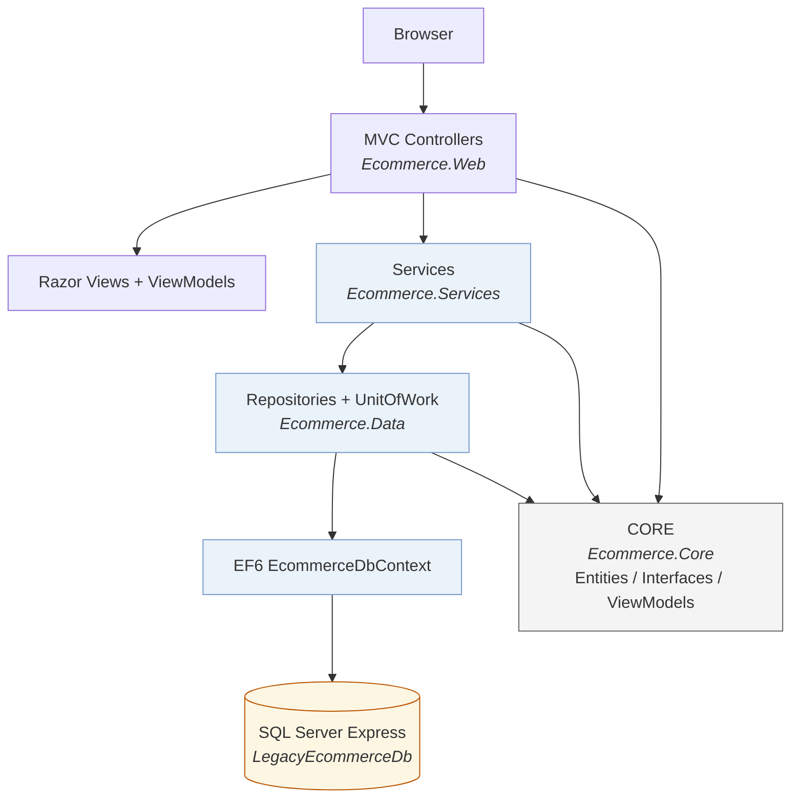

# LegacyEcommerce

ASP.NET MVC 5 (`.NET Framework 4.7`) eCommerce storefront. Four-layer architecture
with Entity Framework 6 against SQL Server Express, Unity IoC, and OWIN cookie
authentication.

## Solution layout

| Project            | Role                                                                 |
| ------------------ | -------------------------------------------------------------------- |
| `Ecommerce.Core`   | POCO entities, view models, repository/service interfaces, common types. No framework dependencies. |
| `Ecommerce.Data`   | `EcommerceDbContext` (fluent EF6 mapping), repository implementations, `UnitOfWork`. |
| `Ecommerce.Services` | Catalog, cart, checkout, account services; pricing rules; PBKDF2 password hashing. |
| `Ecommerce.Web`    | MVC 5 + Razor UI, Unity DI, OWIN auth, session cart.                  |

`DatabaseSetup.sql` (solution root) creates the database, tables, indexes,
the application login, seed catalog data, and the demo customer.

## Architecture



**Dependency direction:** every layer depends on `Ecommerce.Core` (POCO
entities, ViewModels, repository/service interfaces — no framework
dependencies). `Ecommerce.Data` implements repositories over EF6;
`Ecommerce.Services` implements business rules (pricing, cart, checkout,
PBKDF2 hashing, authentication); `Ecommerce.Web` is the MVC 5 UI that wires
everything together with Unity IoC.

**How a request flows:** Browser → MVC route → Controller (services injected
via Unity) → Service → Repository/`UnitOfWork` → `EcommerceDbContext` → SQL
Express → result returned as a Razor view or JSON over AJAX.

**Cross-cutting wiring:**

- Unity registers `EcommerceDbContext` and `UnitOfWork` per HTTP request
  (`HierarchicalLifetimeManager`) so repositories share one context per
  request and `SaveChanges()` commits a single unit of work.
- OWIN cookie authentication (`ApplicationCookie`) issues a
  `ClaimsIdentity`; passwords are hashed with PBKDF2 (10,000 iterations).
- The cart is session-based (`List<CartItem>` in `HttpSessionState`); coupon
  code lives in session too. A `CartItems` table keyed by `Guid` exists in
  the schema for future persistence.
- AJAX posts (cart add/update/remove, coupon) are protected by anti-forgery
  tokens sent as form fields; the `AjaxValidateAntiForgeryToken` filter also
  accepts them via HTTP header for browser compatibility.

## Prerequisites

- Windows with .NET Framework 4.7+ (4.8 recommended).
- SQL Server Express 2016+ (LocalDB works if the connection string is adjusted).
- A way to build MSBuild-based projects, either:
  - Visual Studio 2017/2019/2022 (.NET desktop workload), **or**
  - a .NET SDK / MSBuild install (any recent SDK bundles `MSBuild.exe`).

No targeting pack is required: the projects reference the framework reference
assemblies via the `Microsoft.NETFramework.ReferenceAssemblies.net47` NuGet
package, so they compile on machines without the ".NET Framework 4.7 targeting
pack" installed.

## Setup

1. **Restore packages**

   ```
   nuget restore LegacyEcommerce.sln
   ```

   (or let Visual Studio restore on first build). All libraries are pinned to
   fixed versions, so the build is reproducible offline after the first
   restore.

2. **Create the database** (`DatabaseSetup.sql`)

   - Creates database `LegacyEcommerceDb`.
   - Creates SQL login `legacy_app_user` (password `LegacyPass!123`) mapped to
     `legacy_app_user`, which the app uses to connect.
   - Creates all tables + indexes + foreign keys.
   - Seeds 4 categories, 8 products with images/variants, order/promotion data,
     and the demo customer.

   Run it with SSMS or `sqlcmd`:

   ```
   sqlcmd -S .\SQLEXPRESS -E -i DatabaseSetup.sql
   ```

3. **Connection string** — already correct in `Ecommerce.Web\web.config`
   (SQL auth `legacy_app_user`). To use Windows auth or a different instance,
   edit:

   ```xml
   <add name="EcommerceDb"
        connectionString="Data Source=.\SQLEXPRESS;Initial Catalog=LegacyEcommerceDb;
                          User Id=legacy_app_user;Password=LegacyPass!123;
                          MultipleActiveResultSets=True" />
   ```

## Build

```
MSBuild.exe LegacyEcommerce.sln /t:Restore /t:Build -m:1
```

or in Visual Studio: open `LegacyEcommerce.sln` and press F6.
(Use `-m:1` when building from the command line to avoid a parallel
assembly-resolution race artifact on some SDK MSBuild versions.)

## Run

Run the `Ecommerce.Web` project in IIS Express (F5 in Visual Studio) or host the
site in IIS. The sample page `http://localhost:PORT/` shows the storefront.

The site was verified end-to-end on SQL Server 2022 Express (instance
`.\SQLEXPRESS`) hosted by IIS Express 10:

```
"C:\Program Files\IIS Express\iisexpress.exe" /path:"<checkout>\Ecommerce.Web" /port:50861 /clr:v4.0
```

Smoke-tested: home (200), product listing/detail, search `q=`, category
`Subcategories` AJAX, cart add/update/remove/coupon, coupon `SAVE10` (−10%),
checkout wizard (Address → Shipping → Payment → Confirmation), order history,
register, login, logout, and anti-forgery-protected AJAX posts.

### Demo account

| Field    | Value               |
| -------- | ------------------- |
| Email    | `demo@legacy.store` |
| Password | `Password123!`      |

Order history is available after signing in (`/Account/Orders`).

### Promotions (in `DatabaseSetup.sql`)

- Coupon `SAVE10` — 10% off subtotal.
- Free shipping on orders at or above **$75** (otherwise $9.95).
- Sales tax 8% applied to subtotal after discounts.

## Architecture notes

- **EF6 without a designer**: schema and mappings are defined in code
  (`EcommerceDbContext`, `Index`es via annotation attributes). This project was
  authored without Visual Studio's EDMX designer, hence no `.edmx` file.
- **Dependency injection**: Unity 4 + Unity.Mvc. `EcommerceDbContext` and
  `UnitOfWork` are registered per-request (`HierarchicalLifetimeManager`), so
  repositories share one context per HTTP request and `SaveChanges()` commits
  one unit of work.
- **Authentication**: OWIN cookie auth (`ApplicationCookie`) with a lightweight
  `ClaimsIdentity`; passwords hashed with PBKDF2 (10,000 iterations, 16-byte
  salt, 32-byte hash — see `Ecommerce.Services\Security\PasswordHasher.cs`).
- **Cart**: session-based (`List<CartItem>` in `HttpSessionState`), cheap to
  store; coupon code also kept in session. Schema includes a `CartItems`
  table keyed by `Guid` for future persistence.
- **Razor views** compile at runtime (standard MVC behavior); the web project
  build verifies controllers/services/`App_Start` only.
- Front-end assets (jQuery 3.4.1, jQuery UI, jQuery Validate, Bootstrap 3.4.1,
  DataTables 1.10.21, Fancybox 3.5.7) are vendored under `Scripts/` and
  `Content/` so the site runs offline.

## Specification coverage

Implements the `NET 4.7 MVC eCommerce Legacy-MVC-EF-Sessions-class-plan-Specification.txt` point by point:

| Spec requirement | Where in code |
| --- | --- |
| 4-project layering with strict dependency direction | `Ecommerce.Core` (POCOs/interface/ViewModels) ← `Data` ← `Services` ← `Web` |
| Controllers never touch EF; views bind to ViewModels only | `Controllers/*` + `Views/*` bind `Ecommerce.Core.ViewModels` |
| Repository pattern + `UnitOfWork` over EF6 | `Ecommerce.Data` |
| Unity DI, DbContext/repos per HTTP request | `App_Start/UnityConfig.cs` |
| Razor layout tree `_Layout → _Header / _Sidebar / _Footer` | `Views/Shared/` |
| Catalog: listing, detail, search, lazy category AJAX | `ProductController`, `Views/Product/` |
| Session cart + `MiniCart` child action + AJAX add/update/remove/coupon | `CartController`, `Views/Cart/`, `_Layout` |
| Checkout wizard Address → Shipping → Payment → Confirmation | `CheckoutController`, `Views/Checkout/` |
| OWIN cookie auth, `[Authorize]`, order history | `AccountController`, `Startup.Auth.cs`, `Views/Account/` |
| Anti-forgery tokens on every form + every AJAX POST (field & header) | `AjaxValidateAntiForgeryToken`, `@Html.AntiForgeryToken()` in all forms |
| jQuery 3.4.1, jQuery UI 1.12.1, Validate + Unobtrusive, DataTables, Fancybox 3 — all vendored for offline use | `Scripts/`, `Content/`, `BundleConfig.cs` |
| SQL Express `.\SQLEXPRESS`, DB `LegacyEcommerceDb`, conn `EcommerceDb`, `legacy_app_user` | `web.config`, `DatabaseSetup.sql` |
| `sessionState InProc timeout=25`, `maxRequestLength=30720`, `compilation debug=false`, `authentication mode=None` | `web.config` |

## Notes / deviations from a stock MVC 5 template

- No `Microsoft.AspNet.Identity` — OWIN cookie auth + custom `IAccountService`
  (spec's "ApplicationUser stays in Web" is implemented as a lightweight
  `ClaimsIdentity`; same wire surface, cleaner to migrate later).
- EF6 mappings are **code-first** (`EcommerceDbContext`, annotations) instead of
  the spec's EDMX designer file — the schema is identical and `DatabaseSetup.sql`
  is the source of truth; no `.edmx`/designer codegen to carry forward.
- DataTables pinned to 1.10.21 (newer 1.10.25 was not available from the CDN).
- Package versions are pinned; NuGet reports `NU1903` warnings for old
  Microsoft.Owin/Newtonsoft.Json versions (no safe upgrade path for .NET
  Framework 4.7 OWIN; API surface unchanged).
```